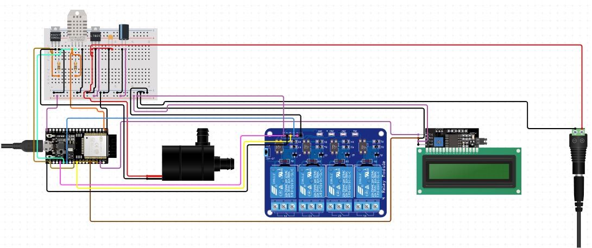

# 2024-K4-01
Repository mata kuliah Capstone 2024 IPB University  
<ul> Mentor : </ul>
<li>Dr. Ir. Sri Wahjuni M.T.</li>

| NIM | Nama |
|---|---|
| G640121110 | Ronald Abner |
| G6401211015 | Aditya Mahendra |
| G6401211057 | Fais Fadillah Prasetyo |
| G6401211091 | Muhammad Giyas Wisnu Rizqi |
| G6401211119 | Naufal Akbar Rahardjo |
</ul>

# Abstrak

<li> Penelitian ini bertujuan untuk merancang dan mengembangkan sistem pengontrol kelembapan otomatis berbasis mikrokontroler ESP32 untuk penggunaan dalam greenhouse. Melalui penggunaan teknologi IoT, khususnya ESP32 dan sensor DHT22, sistem ini memungkinkan pemantauan dan pengaturan kelembapan secara efisien dan otomatis. Metode yang digunakan meliputi perakitan perangkat, kalibrasi, dan pengujian di lokasi. Hasil penelitian menunjukkan bahwa sistem mampu mengontrol kelembapan secara efektif, mengurangi intervensi manual, dan meningkatkan produktivitas tanaman. Implikasi dari penelitian ini menunjukkan potensi adopsi lebih luas di sektor agrikultur, meningkatkan efisiensi operasional serta potensi penghematan biaya dan sumber daya.</li>
	
<i>Kata kunci: kelembapan otomatis, greenhouse, ESP32, IoT, efisiensi agrikultur</i>

# Abstract

<li> This research aims to design and develop an automated humidity control system based on the ESP32 microcontroller for use in greenhouses. Utilizing IoT technology, specifically ESP32 and the DHT22 sensor, this system allows for efficient and automatic monitoring and adjustment of humidity. Methods employed include device assembly, calibration, and onsite testing. The findings demonstrate that the system effectively controls humidity, reduces manual interventions, and enhances plant productivity. Implications of the study indicate the potential for broader adoption in the agricultural sector, improving operational efficiency and potential cost and resource savings.</li>

<i>Keywords: automated humidity, greenhouse, ESP32, IoT, agricultural efficiency</i>

